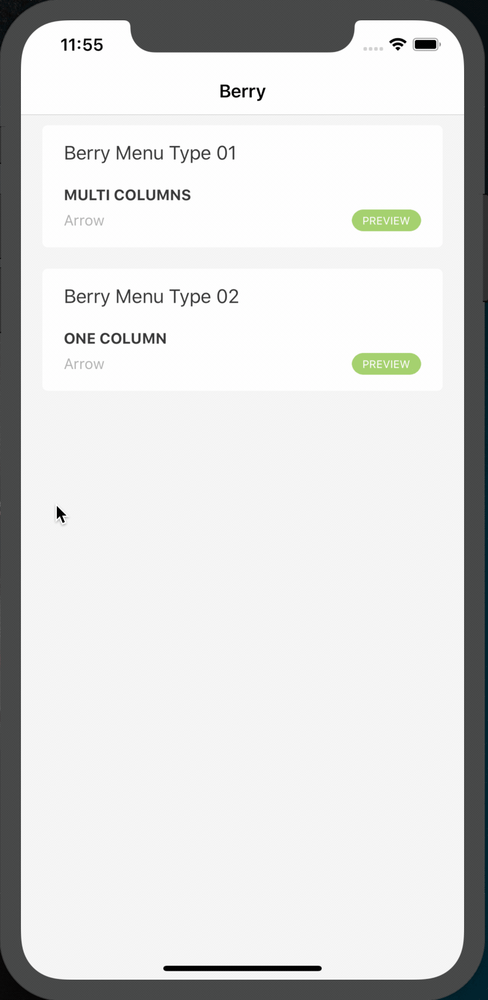

[](https://cocoapods.org/)
[](https://raw.githubusercontent.com/shiwei93/Berry/master/LICENSE)
[](https://cocoapods.org/pods/Berry)
[](https://cocoapods.org/pods/Berry)


**Berry** is an drop down menu written by Swift 4.2.

- [ScreenShots](#screenshots)
  - [Customization & Usage](#customization--usage)
  - [Display & Hide](#display--hide)
- [Installation](#installation)
  - [Cocoapods](#cocoapods)
  - [Manually](#manually)
- [License](#license)

## ScreenShots



### Customization & Usage

But if you want to customize your own drop down menu, **Berry** also provide some properties. You will find detail in Example project.

### Display & Hide

Use `display(withCompletion:)` method to display drop dpwn menu with animation.

```swift
public func display(withCompletion completion: ((Bool) -> Void)? = nil)
```

Use `hide(withCompletion:)` method to hide drop down menu with animation.

```swift
public func hide(withCompletion completion: ((Bool) -> Void)? = nil)
```

## Installation

### Cocoapods

**Berry** is available through [Cocoapods](https://cocoapods.org/).

Add the following line to your `Podfile`

```
pod 'Berry'
```

### Manually

Downloads the berry zip, copy all swift file on the **Berry** folder to your project.

## License

**Berry** is released under the MIT license. See LICENSE for details.


